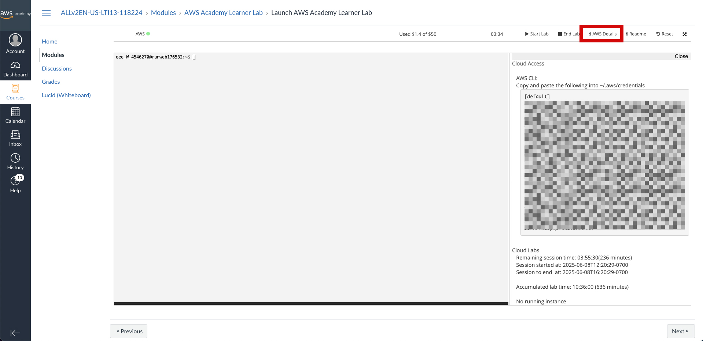
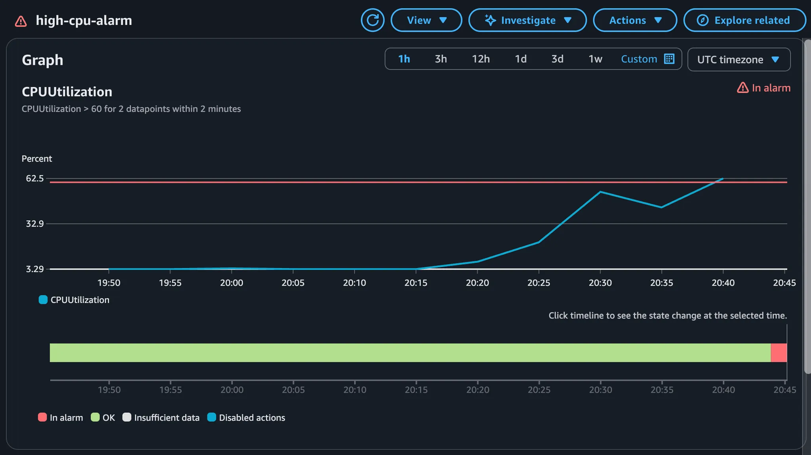
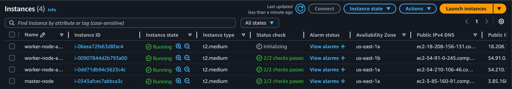
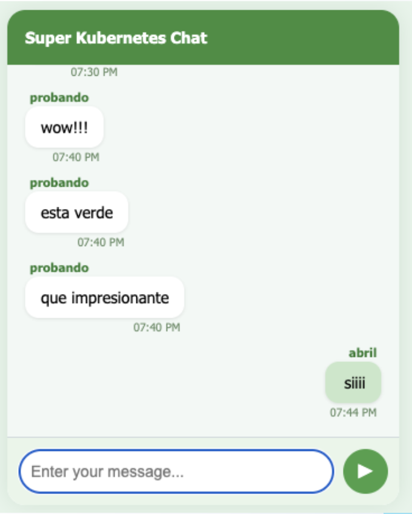

# TP Especial Redes de Información - Grupo 4 Kubernetes

## Profesores

- Cortés Rodríguez, Kevin Imanol
- Ortega, Alberto
- Staudenmann, Luis Alberto
- Valles, Santaigo Raul

## Alumnos

- Liu, Jonathan Daniel - 62533
- Vilamowski, Abril - 62495
- Wischñevsky, David - 62494

## Configuración inicial

### Configurar las credenciales de AWS

Antes de ejecutar cualquier componente del proyecto, es fundamental tener correctamente configuradas las credenciales de AWS.

Al acceder a la consola de AWS, se podrá encontrar un apartado llamado **AWS Details**, donde se encuentran las claves de acceso necesarias para la autenticación.



Estas credenciales deben guardarse en el archivo de configuración ubicado en `~/.aws/credentials`. Para hacerlo, abrir una terminal y ejecutar el siguiente comando:

```bash
sudo nano ~/.aws/credentials
```

### Inicializar y aplicar la infraestructura con Terraform

Una vez que las credenciales estén configuradas correctamente, el siguiente paso es desplegar la infraestructura necesaria usando Terraform. Para ello, deben correrse los siguientes comandos en la terminal:

```bash
cd terraform
terraform init
terraform apply
```

Esto creará todos los recursos necesarios en AWS y dejará el entorno listo para utilizar el sistema.

## User Stories

### 1. Balanceo de carga entre réplicas con WebSockets

### 2. Tolerancia a fallos ante caída de nodo

### 3. Escalado automático por carga

**Objetivo**: Evaluar si Kubernetes escala automáticamente las réplicas del message-service según el uso de CPU.\
**Prueba**: Definir requests y limits de CPU, configurar el Horizontal Pod Autoscaler (HPA) y simular una carga elevada.\
**Resultado esperado**: El número de réplicas aumenta cuando la CPU supera el umbral y disminuye cuando baja la carga, mejorando la capacidad de respuesta del servicio

Se realizó una prueba de estrés sobre los nodos worker utilizando la herramienta `stress` para simular una carga elevada y evaluar el comportamiento del clúster en condiciones exigentes.

```bash
apt update 
apt -y install stress
stress -c 10000 -m 250 -t 180s
```

Durante la ejecución, se activó una alarma configurada en CloudWatch que monitorea el uso de CPU. La alarma estaba definida con un umbral del 60 % de utilización sostenida durante al menos 2 minutos.
Como se observa en la siguiente gráfica, el consumo de CPU superó dicho umbral, lo que disparó correctamente el estado In alarm, validando el funcionamiento del sistema de alertas y el monitoreo de recursos.



Como resulesta, se inicializaron nuevas instancias EC2 destinadas a ampliar la capacidad del clúster



### 4. Actualización sin downtime y rollback

**Objetivo**: Actualizar message-service sin afectar la disponibilidad del sistema y permitir una reversión rápida si falla.\
**Prueba**: Cambiar la imagen del contenedor en el deployment, monitorear la actualización y revertir si es necesario.\
**Resultado esperado**: La actualización se realiza con rolling update sin cortes, y puede deshacerse fácilmente en caso de error.

#### message-service

1. Conectarse a la instancia EC2 provista por Terraform:

   ```bash
   ssh <dirección-del-ec2>
   ```

2. Navegar al directorio del chart de Helm

   ```bash
   cd /tpe-redes-g4/charts/message-service-chart
   ```

3. Editar el archivo `values.yaml` para cambiar el tag de la imagen por uno inexistente:

   ```bash
   sudo nano values.yaml
   ```

4. Verificar el estado actual de los pods:

   ```bash
   kubectl get pods
   ```

5. Aplicar la actualización:

   ```bash
   helm upgrade message-service .
   ```

6. Confirmar que el nuevo pod falla al iniciarse (estado `ErrImagePull`):

   ```bash
   kubectl get pods
   ```

7. Revertir la actualización:

   ```bash
   helm rollback message-service
   ```

8. Verificar que el pod vuelve a estar en funcionamiento:

   ```bash
   kubectl get pods
   ```

#### chat-frontend

La imagen con el tag `green` ya se encuentra publicada en Docker Hub y puede ser utilizada directamente.

1. Conectarse a la instancia EC2 provista por Terraform:

   ```bash
   ssh <dirección-del-ec2>
   ```

2. Navegar al directorio del chart de Helm del frontend:

   ```bash
   cd /tpe-redes-g4/charts/chat-frontend
   ```

3. Editar el archivo `values.yaml` y modificar el tag de la imagen a `green`:

   ```bash
   sudo nano values.yaml
   ```

4. Aplicar la actualización:

   ```bash
   helm upgrade chat-frontend .
   ```

5. Verificar visualmente que la interfaz web aparece con color verde.

   

6. Ejecutar un rollback para volver al estado anterior (color violeta):

   ```bash
   helm rollback chat-frontend
   ```

7. Confirmar que la interfaz vuelve a su apariencia original.

### 5. Acceso centralizado mediante Ingress

**Objetivo**: Acceder a múltiples servicios desde un único punto de entrada mediante reglas de URL.\
**Prueba**: Configurar un Ingress Controller y definir rutas que direccionen el tráfico a frontend y message-service según la URL.\
**Resultado esperado**: Ambos servicios son accesibles desde un único dominio, facilitando la gestión de accesos.

#### Comandos de prueba

- Acceso al frontend

   ```bash
   curl http://<IP_EC2>/frontend
   ```

- Acceso al backend

   ```bash
   curl http://<IP_EC2>/api/users
   ```

### 6. Persistencia de datos

**Objetivo**: Garantizar que los datos del chat persistan aunque el pod se reinicie o reemplace.\
**Prueba**: Conectar el servicio a un volumen persistente, eliminar el pod y verificar la persistencia de datos tras el reinicio.\
**Resultado esperado**: Los datos de los usuarios se conservan, confirmando que el estado no se pierde al reiniciar el contenedor.

1. Desinstalar el servicio

   ```bash
   helm uninstall message-service
   ```

2. Verificar que los volúmenes aún existen

   ```bash
   kubectl get pv
   kubectl get pvc
   ```

3. Confirmar que la aplicación web deja de estar disponible temporalmente

   ```bash
   curl http://<IP_EC2>/api/users
   ```

4. Reinstalar el servicio

   ```bash
   helm install message-service .
   ```

5. Verificar que el pod vuelve a estar en funcionamiento

   ```bash
   kubectl get pods
   ```

6. Confirmar que la página vuelve a funcionar correctamente con los datos anteriores, lo que demuestra la persistencia del estado entre instalaciones.
