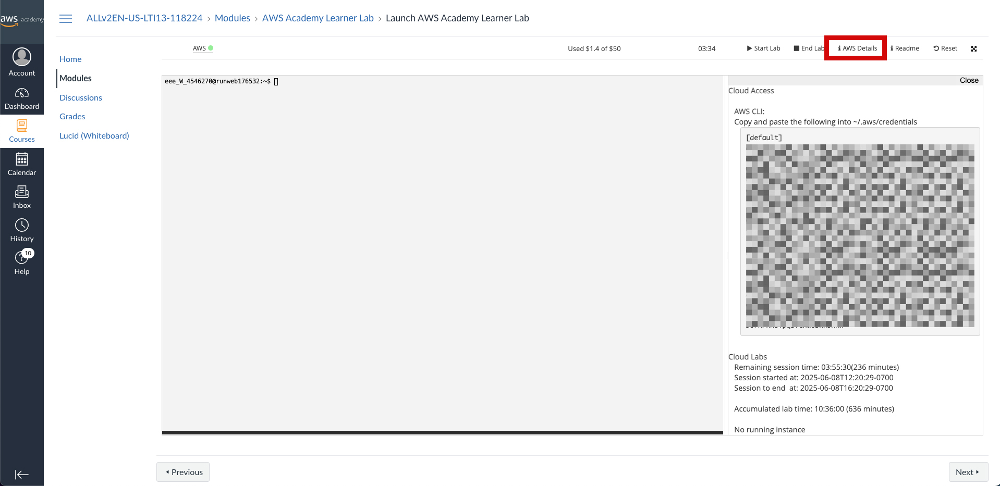
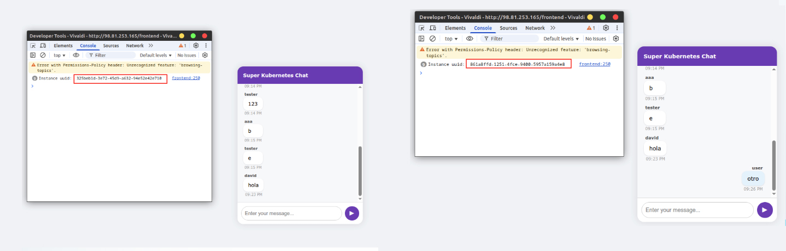
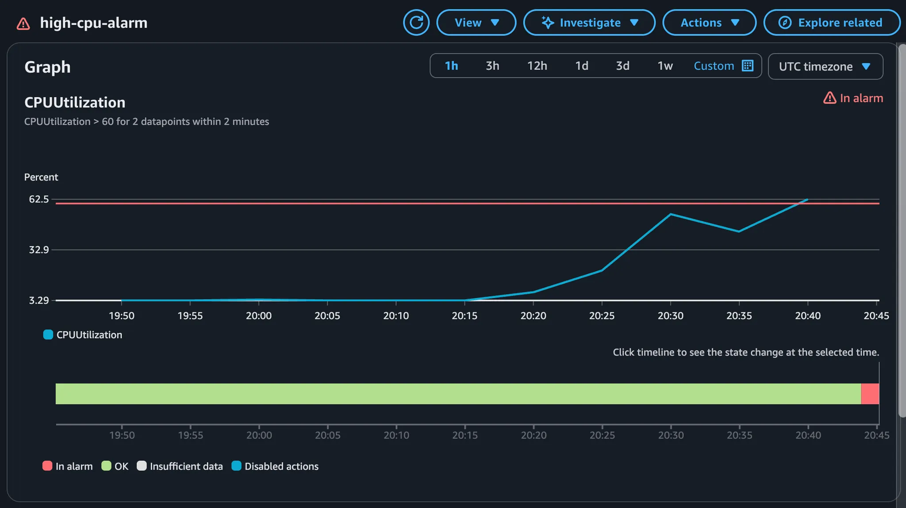
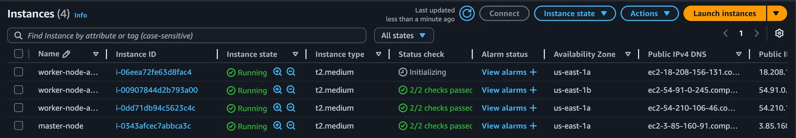
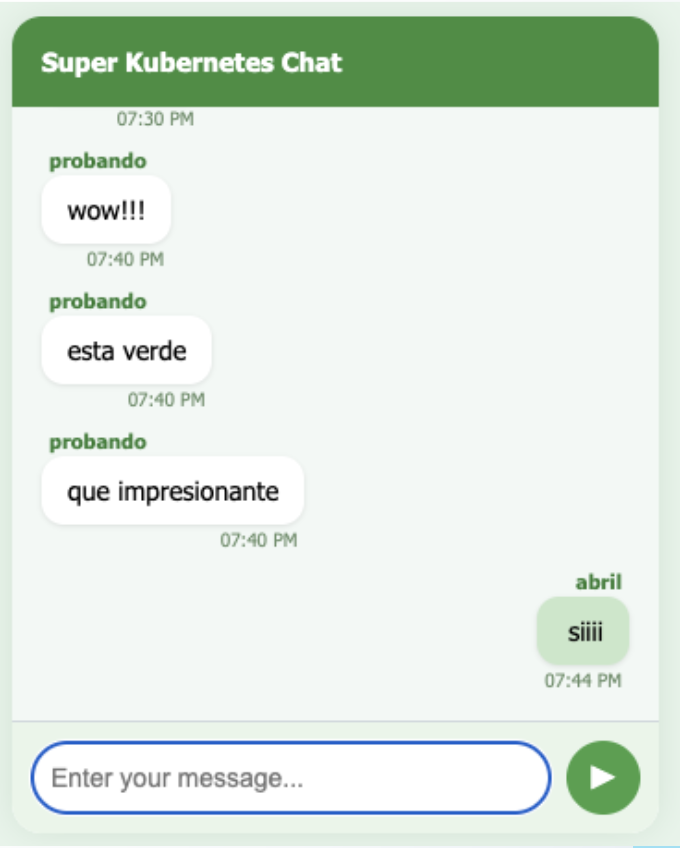

# TP Especial Redes de Información - Grupo 4 Kubernetes

## Profesores

- Cortés Rodríguez, Kevin Imanol
- Ortega, Alberto
- Staudenmann, Luis Alberto
- Valles, Santaigo Raul

## Alumnos

- Liu, Jonathan Daniel - 62533
- Vilamowski, Abril - 62495
- Wischñevsky, David - 62494

## Configuración inicial

### Configurar las credenciales de AWS

Antes de ejecutar cualquier componente del proyecto, es fundamental tener correctamente configuradas las credenciales de AWS.

Al acceder a la consola de AWS, se podrá encontrar un apartado llamado **AWS Details**, donde se encuentran las claves de acceso necesarias para la autenticación.



Estas credenciales deben guardarse en el archivo de configuración ubicado en `~/.aws/credentials`. Para hacerlo, abrir una terminal y ejecutar el siguiente comando:

```bash
sudo nano ~/.aws/credentials
```
luego, copiar las claves de acceso en el archivo.

### Actualizar el archivo de locals.tf
En el archivo `terraform/locals.tf`, se debe actualizar la variable `key_file_name` con la ruta al archivo de clave pública SSH que se utilizará para acceder a las instancias EC2.

```hcl
key_file_name = "~/.ssh/id_rsa.pub"
```

### Inicializar y aplicar la infraestructura con Terraform

Una vez que las credenciales estén configuradas correctamente, el siguiente paso es desplegar la infraestructura necesaria usando Terraform. Para ello, deben correrse los siguientes comandos en la terminal:

```bash
cd terraform
terraform init
terraform apply
```

Esto creará todos los recursos necesarios en AWS y dejará el entorno listo para utilizar el sistema.

### Conexión por SSH a la instancia EC2
Una vez que la infraestructura esté desplegada, se podrá acceder a la instancia EC2 creada por Terraform. Para conectarse, se debe utilizar el comando SSH con la clave privada generada durante el proceso de creación de la infraestructura.

```bash
ssh ubuntu@<nombre-de-la-instancia-ec2>
```

Para poder usar `kubectl` y `helm` dentro de la instancia EC2, es necesario configurar las herramientas correspondientes. Para ello, se deben ejecutar los siguientes comandos (los mismos que corre el script `terraform/user_data/master.sh`):

```bash
export KUBECONFIG=~/.kube/config
mkdir ~/.kube 2> /dev/null
sudo k3s kubectl config view --raw > "$KUBECONFIG"
chmod 600 "$KUBECONFIG"
```

## User Stories

### 1. Balanceo de carga entre réplicas con WebSockets

#### Objetivo

Distribuir automáticamente el tráfico WebSocket del message-service entre múltiples réplicas usando Kubernetes y un Ingress que utiliza un Controller de Traefik

#### Prueba

Se desplegó el message-service con varias réplicas y se expuso mediante un recurso Ingress configurado para enrutar tráfico WebSocket. Luego se abrieron múltiples conexiones al endpoint público y se verificó, mediante un identificador único por pod, que las conexiones fueron manejadas por distintos pods.

Se ingresó al chat con dos usuarios distintos desde navegadores separados. En la consola de cada navegador se muestra un identificador UUID diferente, correspondiente al pod que atendió cada conexión. Esto refleja que cada usuario fue redirigido a un pod distinto dentro del clúster de Kubernetes.




#### Resultado esperado

El tráfico WebSocket se balancea automáticamente entre réplicas del servicio, validando que Kubernetes y Traefik gestionan correctamente las conexiones persistentes sin configuración adicional.


### 2. Tolerancia a fallos ante caída de nodo

#### Objetivo

Verificar que Kubernetes reubica automáticamente los pods si una instancia EC2 del clúster falla.

#### Prueba

Se apagó manualmente una instancia EC2 (con cuidado de que no fuera la que contenia la base de datos, ya que no está replicada). Se observó cómo Kubernetes detectó la caída y reprogramó los pods en nodos disponibles.

1. Buscar el nombre del nodo que no contiene la base de datos y verificar que tiene pods del message-service:

   ```bash
   kubectl get pods -o wide
   ```

2. Apagar la instancia EC2

3. Verificar que los pods se reprograman en otros nodos:

   ```bash
   kubectl get pods -o wide
   ```

Adicionalmente, el autoscaling group de AWS detectó la caída y lanzó una nueva instancia EC2 para mantener la capacidad del clúster.

#### Resultado esperado

Los pods continúan funcionando en otros nodos sin intervención manual, garantizando alta disponibilidad.

### 3. Escalado automático por carga


#### Objetivo

Evaluar si Kubernetes escala automáticamente las réplicas del message-service según el uso de CPU.

#### Prueba

Definir requests y limits de CPU, configurar el Horizontal Pod Autoscaler (HPA) y simular una carga elevada.


#### Prueba de estrés sobre nodos

Se realizó una prueba de estrés sobre los nodos utilizando la herramienta `stress` para simular una carga elevada y evaluar el comportamiento del clúster en condiciones exigentes.
En este caso, la conexión se realiza a la instancia EC2 de un nodo worker.

```bash
apt update 
apt -y install stress
stress -c 10000 -m 250 -t 180s
```

Durante la ejecución, se activó una alarma configurada en CloudWatch que monitorea el uso de CPU. La alarma estaba definida con un umbral del 60 % de utilización sostenida durante al menos 2 minutos.
Como se observa en la siguiente gráfica, el consumo de CPU superó dicho umbral, lo que disparó correctamente el estado In alarm, validando el funcionamiento del sistema de alertas y el monitoreo de recursos.




Como resultado, se inicializaron nuevas instancias EC2 destinadas a ampliar la capacidad del clúster



#### Prueba de estrés sobre pods

Esta prueba se realizó utilizando dos terminales simultáneamente.

Terminal 1 – Simular carga de CPU

1. **Ver el estado actual del HPA:**
   ```bash
   kubectl get hpa
   ```

2. **Acceder a uno de los pods del deployment:**
   ```bash
   kubectl exec -it message-service-6bc5d55b49-h4xc8 -- sh
   ```
   > Reemplazar el nombre del pod por el que esté en ejecución en ese momento.

3. **Ejecutar un bucle infinito para simular carga de CPU:**
   ```sh
   while true; do continue; done
   ```

Terminal 2 – Monitorear el estado del HPA

4. **Ejecutar un monitoreo en tiempo real del estado del HPA:**
   ```bash
   watch kubectl get hpa
   ```

#### Resultado esperado

El número de réplicas aumenta cuando la CPU supera el umbral y disminuye cuando baja la carga, mejorando la capacidad de respuesta del servicio

### 4. Actualización sin downtime y rollback

#### Objetivo

Actualizar message-service sin afectar la disponibilidad del sistema y permitir una reversión rápida si falla.

#### Prueba

Cambiar la imagen del contenedor en el deployment, monitorear la actualización y revertir si es necesario.

#### message-service

1. Una vez realizada la conexión vía ssh al nodo master, navegar al directorio del chart de Helm

   ```bash
   cd /tpe-redes-g4/charts/message-service-chart
   ```

2. Editar el archivo `values.yaml` para cambiar el tag de la imagen por uno inexistente:

   ```bash
   sudo nano values.yaml
   ```

3. Verificar el estado actual de los pods:

   ```bash
   kubectl get pods
   ```

4. Aplicar la actualización:

   ```bash
   helm upgrade message-service .
   ```

5. Confirmar que el nuevo pod falla al iniciarse (estado `ErrImagePull`):

   ```bash
   kubectl get pods
   ```

6. Revertir la actualización:

   ```bash
   helm rollback message-service
   ```

7. Verificar que el pod vuelve a estar en funcionamiento:

   ```bash
   kubectl get pods
   ```

#### chat-frontend

La imagen con el tag `green` ya se encuentra publicada en Docker Hub y puede ser utilizada directamente.

1. Una vez realizada la conexión vía ssh al nodo master, navegar al directorio del chart de Helm del frontend:

   ```bash
   cd /tpe-redes-g4/charts/chat-frontend
   ```

2. Editar el archivo `values.yaml` y modificar el tag de la imagen a `green`:

   ```bash
   sudo nano values.yaml
   ```

3. Aplicar la actualización:

   ```bash
   helm upgrade chat-frontend .
   ```

4. Verificar visualmente que la interfaz web aparece con color verde.

   

5. Ejecutar un rollback para volver al estado anterior (color violeta):

   ```bash
   helm rollback chat-frontend
   ```

6. Confirmar que la interfaz vuelve a su apariencia original.

#### Resultado esperado

La actualización se realiza con rolling update sin cortes, y puede deshacerse fácilmente en caso de error.

### 5. Acceso centralizado mediante Ingress

#### Objetivo

Acceder a múltiples servicios desde un único punto de entrada mediante reglas de URL.

#### Prueba

Configurar un Ingress Controller y definir rutas que direccionen el tráfico a frontend y message-service según la URL.

#### Comandos de prueba

- Acceso al frontend

   ```bash
   curl http://<IP_EC2>/frontend
   ```

- Acceso al backend

   ```bash
   curl http://<IP_EC2>/api/users
   ```
#### Resultado esperado

Ambos servicios son accesibles desde un único dominio, facilitando la gestión de accesos.

### 6. Persistencia de datos

#### Objetivo

Garantizar que los datos del chat persistan aunque el pod se reinicie o reemplace.
#### Prueba

Conectar el servicio a un volumen persistente, eliminar el pod y verificar la persistencia de datos tras el reinicio.

1. Desinstalar el servicio

   ```bash
   helm uninstall message-service
   ```

2. Verificar que los volúmenes aún existen

   ```bash
   kubectl get pv
   kubectl get pvc
   ```

3. Confirmar que la aplicación web deja de estar disponible temporalmente

   ```bash
   curl http://<IP_EC2>/api/users
   ```

4. Reinstalar el servicio

   ```bash
   helm install message-service .
   ```

5. Verificar que el pod vuelve a estar en funcionamiento

   ```bash
   kubectl get pods
   ```

6. Confirmar que la página vuelve a funcionar correctamente con los datos anteriores, lo que demuestra la persistencia del estado entre instalaciones.

#### Resultado esperado

Los datos de los usuarios se conservan, confirmando que el estado no se pierde al reiniciar el contenedor.